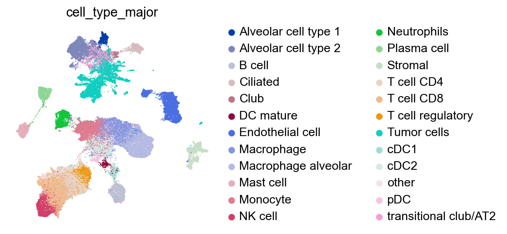
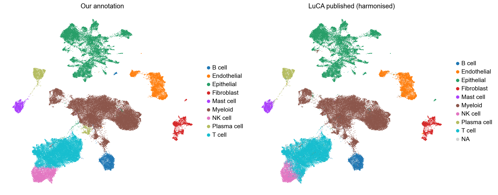
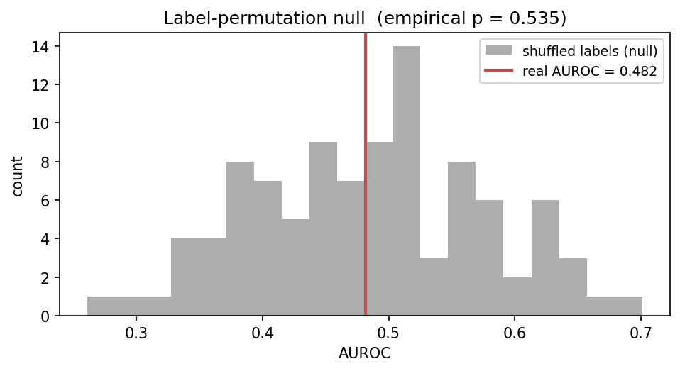
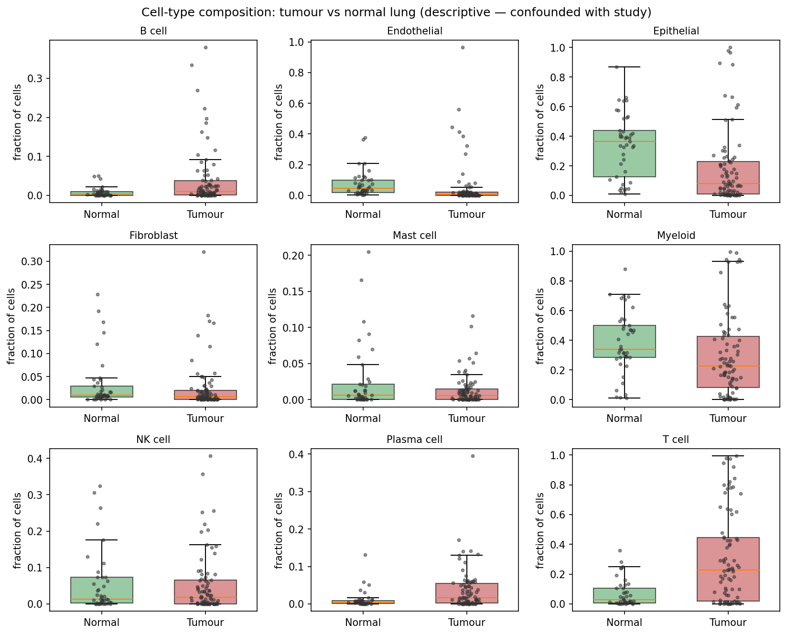

# scRNA-seq Tumor Microenvironment Analysis — Lung (LuCA)

✅ **Complete** — end-to-end scRNA-seq analysis pipeline (notebooks 01–04), built May 2026.

> **In one line:** cell-type annotation reproduced LuCA's published expert labels at **95% agreement (ARI 0.92)**; per-patient cell-state composition did **not** predict LUAD vs LUSC histology — a clean, honestly reported **null result** under leave-one-study-out cross-validation.

End-to-end single-cell RNA-seq pipeline applied to the **LuCA core atlas of lung cancer cell states** (Salcher et al. 2022, *Cancer Cell*; 892K cells, 19 integrated NSCLC studies). Uses the 2026-standard pharma comp-bio stack — **scanpy + scVI** plus direct HDF5 reads via `h5py` for memory-efficient subsampling — for QC, embedding evaluation, cell-type annotation, and downstream compositional analysis of LUAD vs LUSC.



*The ~92K-cell working subsample embedded on the scVI latent space, colored by annotated cell lineage.*

**Author:** Osmanjan Timtura, Ph.D. · [LinkedIn](https://www.linkedin.com/in/osmanjan-timtura-b08316245/) · [GitHub](https://github.com/OsmanjanTimtura)

---

## Project plan

See [PROJECT_PLAN.md](PROJECT_PLAN.md) for the full 6–8 week scope, dataset choice, biological question, phases, risks, and what's deliberately out of scope.

**Short version:** Salcher et al. 2022 lung cancer atlas (LuCA) → stratified subsample (~100K cells) → QC + scVI batch integration → cell-type annotation benchmarked against published LuCA labels → per-patient cell-state composition → gradient-boosted-tree classifier (scikit-learn) predicting LUAD vs LUSC histology with leave-one-study-out cross-validation. **Stretch (not pursued):** within-LUAD never-smoker vs smoker compositional comparison.

## Status

| Phase | Status |
|---|---|
| 1. Setup + LuCA subsample (h5py streaming, no Census-API dep) | ✅ done |
| 2. QC + filter + normalize (notebook 01) | ✅ done |
| 3. scVI integration (notebook 02) | ✅ done |
| 4. Cell-type annotation vs LuCA benchmark (notebook 03) | ✅ done |
| 5. LUAD vs LUSC compositional analysis (notebook 04) | ✅ done |
| 6. Writing + polish | ✅ done |
| 7. (Stretch) never-smoker vs smoker analysis | — not pursued |

## Results

**Cell-type annotation (notebook 03).** Leiden clustering on the scVI latent
space, combined with marker-gene scoring of nine major lineages, assigned
every cell in the ~92K-cell subsample to a coarse cell type. Benchmarked
against LuCA's published expert annotation (24 categories harmonised down to
the same nine), the labelling **agreed on 95.2% of cells** with an
**Adjusted Rand Index of 0.92**; per-lineage recall ranged 0.86–1.00. The one
soft spot — a fraction of NK cells called as T cells — reflects the
well-known transcriptional overlap between NK and cytotoxic CD8 T cells.



*Left: our marker-gene annotation. Right: LuCA's published expert labels
harmonised to the same nine lineages — the two agree on 95.2% of cells.*

**LUAD vs LUSC from composition — a null result (notebook 04).** Per-patient
cell-type composition vectors (nine proportions) were used to predict
adenocarcinoma vs squamous-cell histology across **71 patients** (50 LUAD /
21 LUSC, 10 studies) under **leave-one-study-out cross-validation**. The
result is null: gradient-boosted trees reached **AUROC 0.48** — no better
than the dummy baseline (0.44) and indistinguishable from a 100-iteration
label-shuffle null (mean 0.48, **empirical p = 0.54**).



*The real classifier's AUROC (0.48) sits squarely inside the 100-iteration
label-shuffle null distribution — empirical p = 0.54, i.e. no signal.*

This is a genuine negative result, not a pipeline failure: a synthetic
positive control recovered a planted signal at AUROC 0.83, and the model and
dummy baseline land in the same place — the signature of "no signal" rather
than "broken model." It is also biologically reasonable. LUAD and LUSC differ
chiefly in the *malignant epithelial cells' differentiation program*, not in
the *proportions* of immune and stromal cell types; and per-patient
composition carries large study- and sampling-driven technical variation.
A clean null under rigorous cross-validation, reported honestly, is a
legitimate finding.

**Tumour vs normal — descriptive only, by design.** Composition separates
tumour tissue (immune-infiltrated) from normal lung (epithelial- and
endothelial-dominated) in the expected direction. But in LuCA every normal
sample comes from a separate non-cancer lung atlas — **zero studies contain
both tumour and normal donors** — so tumour/normal status is perfectly
confounded with study-of-origin. A classifier would report an uninterpretable
mixture of biology and batch, so this contrast is presented descriptively
only, with the confound documented explicitly. Recognising a confound and
declining to over-claim is part of the demonstration.



*Composition separates tumour from normal lung in the expected direction — but
study-of-origin is perfectly confounded with tissue type, so this contrast is
shown descriptively only.*

## Getting started

```bash
git clone https://github.com/OsmanjanTimtura/scrnaseq-tumor-microenvironment.git
cd scrnaseq-tumor-microenvironment

# Recommended: conda env so h5py / scanpy stay on a known numpy ABI
conda create -n scrnaseq -c conda-forge python=3.11 scanpy anndata leidenalg \
    python-igraph jupyter ipykernel h5py pandas numpy matplotlib seaborn \
    scikit-learn pytest -y
conda activate scrnaseq
pip install scvi-tools  # not on conda-forge yet

# One-time data setup (see data/README.md for the full guide):
#   1. Download luca_core.h5ad (~13 GB) from the CELLxGENE portal.
#   2. Build the 100K subsample (~770 MB, ~3 min):
python -m src.subsample

jupyter notebook notebooks/01_data_download_and_qc.ipynb
```

## Tools

`Python 3.11` · `scanpy` · `anndata` · `scvi-tools` · `h5py` · `leiden` · `scikit-learn` · `pandas` · `numpy` · `matplotlib` · `seaborn` · `Jupyter` · `pytest`

## What this repo demonstrates

- Streaming subsample of a multi-study scRNA-seq atlas straight out of HDF5
  (sparse-CSR slicing via `h5py` + `anndata.io.sparse_dataset`) — no need to
  materialize the 13 GB file in RAM
- Stratified sampling preserving per-study and per-disease balance (19 cohorts
  × 5 disease labels)
- QC filtering against an atlas that already carried pre-computed metrics
  (`n_genes_by_counts`, `pct_counts_mito`, `doublet_status`) — comparing our
  thresholds against the atlas's own
- scVI batch correction with `study` as the batch key
- Marker-gene-based cell-type annotation, benchmarked against LuCA's published
  labels (95% agreement, ARI 0.92)
- Per-patient cell-state composition analysis with a **leave-one-study-out
  cross-validated** classifier (scikit-learn gradient-boosted trees), a
  label-permutation negative control, and permutation feature importance
- Recognising a study/label confound in the tumour-vs-normal contrast and
  reporting it descriptively rather than fitting an uninterpretable classifier
- Honest reporting of a null result, with explicit limitations

## Provenance

Part of a self-directed computational-biology portfolio, alongside
`codon-discovery-pca-kmeans` and `cell-confluency-segmentation`. The LuCA atlas
was chosen for its scale and 19-study structure, which deliberately stress-test
memory-efficient data handling, batch integration, and cross-study
generalization.

## License

[MIT](LICENSE) — reuse freely.
